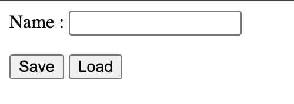

# Mini Project: Browser Storage

## Assignment
**Topic:** Browser Storage (localStorage & sessionStorage)

## Project Description
A simple HTML page that demonstrates the use of browser storage.

### Features
- One input field to enter a name
- Two buttons: **Save** and **Load**
- **Save Button**
  - Stores the entered name in `localStorage`
  - Stores the same name in `sessionStorage`
- **Load Button**
  - Retrieves and displays values from both storages

---

## Screenshot: Main UI
*(Input field and Save/Load buttons)*

---

## Screenshot: After Loading Data
*(Data saved in localStorage and sessionStorage)*

---

## Screenshot: Closing tab and then reopening and load
*(Retrieved values displayed on the page)*

---

## Conclusion
This mini project shows how data can be stored and retrieved using browser storage mechanisms like `localStorage` and `sessionStorage`.
